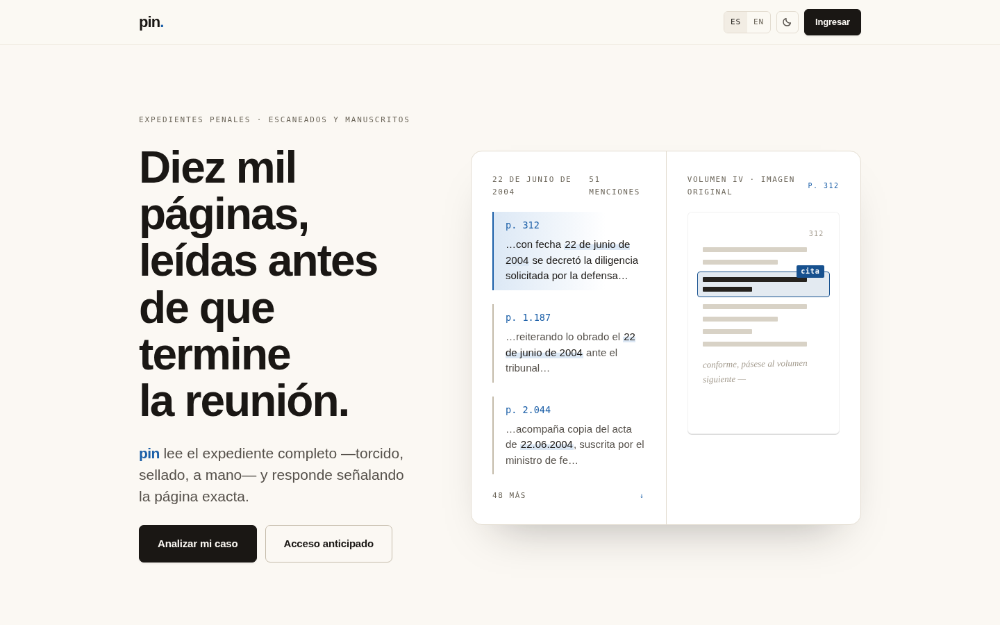

# pin-landing

Commercial landing page for **pin** (working name) — the case-file reading
product currently developed as foja. A fully static Astro site: Spanish at `/`,
English at `/en/`, light and dark themes, zero external requests at runtime
(no CDNs, no web fonts, no analytics). A blog lives at `/blog` (Spanish only,
reachable only from the footer — see `planning/plans/E01-blog.md`).

> [!IMPORTANT]
> **State (2026-07-30):** the landing implements fidelity contract **v10** and
> is merged to `main` with a 66/66 visual-fidelity pass. Both lead-capture
> forms submit via [Web3Forms](https://web3forms.com) when
> `PUBLIC_WEB3FORMS_KEY` is set — without it they degrade to on-screen
> confirmation only. Publishing runs through the GitHub Pages workflow; every
> step is in [docs/DEPLOY.md](docs/DEPLOY.md).



## Run it

```bash
npm install
npm run dev        # dev server
npm run build      # production build
npm run preview    # serve dist/
npm run demo       # build + preview exposed on all interfaces (for ngrok)
```

Node 22+. To demo over the internet: `npm run demo`, then `ngrok http 4321`
(details and owner setup steps in [docs/DEPLOY.md](docs/DEPLOY.md)).

<!-- BOARD-SUMMARY:START -->
## Roadmap at a glance

**8 issues** — backlog 2 · ready 0 · in-dev 0 · review 0 · staging 6 · production 0

E01 (blog section) shipped its trilogy: I-001 (infrastructure), I-002, I-003 and I-008
(all three posts) are staging and all three are live in the `/blog/` listing. I-006
(share CTA — X/LinkedIn + copy-link, no comment box, owner decision 05/08) and I-007
(listing tags + a tag filter, owner request 05/08 stood in for its mockup gate) also
shipped, staging. I-005 (English posts + a locale-aware structure) stays backlogged.
I-004 (static mode for low-end hardware) backlogged, no epic yet. Full board:
[planning/BOARD.md](planning/BOARD.md) (generated by roadmap-board — never
hand-edit).
<!-- BOARD-SUMMARY:END -->

<details>
<summary>Structure, i18n, fidelity contract, gates and evidence — the full map</summary>

### Structure

| Path | What |
|---|---|
| `src/pages/index.astro`, `src/pages/en/index.astro` | The two routes (ES default, EN prefixed) |
| `src/components/` | One component per landing section (Hero, Figures, Ask, Thesis, Quotes, ApplyForm, AccessView, …) |
| `src/scripts/main.ts` | All client behavior: theme, reveals, viewer, typing, forms (Web3Forms submit) |
| `src/i18n/index.ts` | Verbatim ES/EN dictionaries copied from the fidelity contract |
| `src/styles/global.css` | Design tokens (both themes) and all styles |
| `design/prototype/pin-landing-v12.html` | **The visual-fidelity contract** (supersedes v8/v10) |
| `design/evidence/` | Committed screenshots: hero/form/footer/full page, light/dark × ES/EN |
| `.github/workflows/deploy-pages.yml` | GitHub Pages deploy (live; see docs/DEPLOY.md) |
| `src/content.config.ts`, `src/content/blog/es/*.md` | Blog content collection (ES only, plain Markdown, no MDX/CMS) |
| `src/pages/blog/index.astro`, `src/pages/blog/[slug].astro`, `src/components/BlogLayout.astro` | Blog listing and post routes, reusing the same design tokens — reachable only from the footer link |

### i18n

Astro i18n routing, `defaultLocale: 'es'`, no prefix for ES. The ES/EN header
buttons navigate between `/` and `/en/` (base-aware under GitHub Pages).
Copy is verbatim from the contract — never rewrite it in place.

### Fidelity contract

`design/prototype/pin-landing-v12.html` — adopted 2026-08-05, supersedes the v8/v10
contract (editorial pass: the privacy promise said once instead of ten times,
rewritten figures, a fourth thesis point — "what it does not do" — real footer
anchors, a skip link and no-JS fallback, keyboard access on the viewer). On any
doubt, the prototype wins. Deliberate deltas from the prototype, and only these:
language switch navigates routes instead of re-translating the DOM; theme toggle
persists in localStorage; Web3Forms submission with a localized error state (the
prototype had no backend at all).

### Forms / Web3Forms

Both forms (apply + access) POST JSON to `https://api.web3forms.com/submit`
with `access_key` = `PUBLIC_WEB3FORMS_KEY` (build-time env, see
`docs/CONFIG.md` and `.env.example`). Hidden `botcheck` honeypot in both.
No key → degraded mode: browser validation + on-screen confirmation, nothing
sent. Failure → localized ES/EN error, form stays editable.

### Gates

`check-gates` runs in CI on every PR (this repo is public, so Actions is not
affected by the account's billing block on private repos). Run the same gate
locally before opening one — bare, reading each exit code:

```bash
scripts/check-gates.sh --base origin/main
npm run build
npx astro check
```

Plus the bootflower pre-PR gate (`.claude/rules/01-pre-pr-gate.md`): docs,
config registry, security sweep, changelog, PR body. UI changes ship committed
screenshots under `design/evidence/` (check-gates step 8).

### Evidence

`design/evidence/` holds the fidelity run (`fidelity-v10/`, 66/66 PASS) and
per-surface captures: hero, form, footer, full-page order, mobile, and the
form error state — each in light/dark × ES/EN where applicable.

</details>
